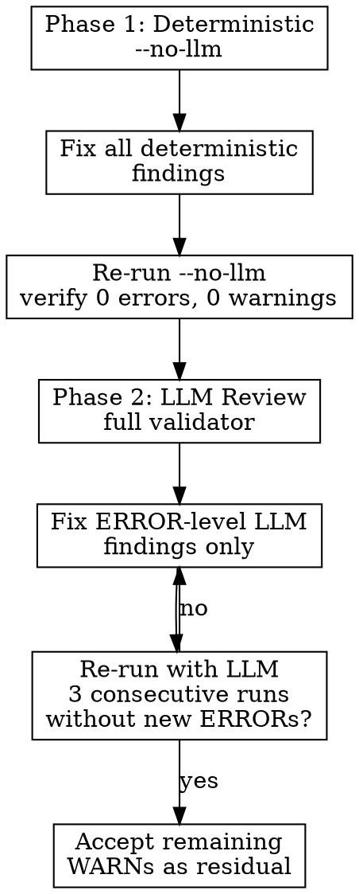

# Spec Quality — Automated EARS Validation

## Overview

Run the project's `ears_validator` tool to evaluate EARS requirements. The validator runs two layers by default: deterministic checks (structure, patterns, IDs, overlap) and LLM-powered review (atomicity, testability, missing error cases). Do not manually review files — the tool is faster and more thorough.

**The two layers behave fundamentally differently.** Deterministic fixes are stable (fix once, stays fixed). LLM findings regenerate as you fix others — they need a different strategy.

## Command

```sh
python3 -m doc_tools.ears_validator docs/ears/
```

This runs both deterministic and LLM review by default. Use `--no-llm` for deterministic-only, `--format json` for machine output, `--fail-on warn` for CI. See `--help` for all flags.

The LLM layer needs `OPENAI_API_KEY` set (see `doc_tools/ears_validator/README.md`).

## When to Use

- After drafting requirements with `spec-draft`
- After fixing issues found by `spec-review`
- Before committing changes to `docs/ears/`

## Finding Codes

Run `python3 -m doc_tools.ears_validator --help` for the full list. Key categories:

**Deterministic:** structural errors (duplicate-id, pattern-shape, missing-reference), path warnings (source-evidence-missing, source-evidence-format), quality warnings (vague-language, weak-ac-verb, atomicity, compound-requirement, missing-error-coverage, possible-overlap)

**LLM:** semantic issues (atomicity, testability, untestable-ac, vague-wording, missing-error-case, internal-contradiction, misaligned-ac, overlap)

## Workflow



### Phase 1: Deterministic (must be clean)

1. Run `python3 -m doc_tools.ears_validator docs/ears/ --no-llm`
2. Fix ALL findings — deterministic fixes are stable, every one counts
3. Re-run until: **0 errors, 0 warnings**

#### Deterministic Detection Rules

Understanding these rules lets you fix findings in one pass instead of guessing.

**`compound-requirement`** triggers when ALL three conditions are true:
- Requirement text contains `" and "` (case-insensitive)
- Requirement text contains at least 1 `"shall"`
- Requirement text is longer than 180 characters

Fix strategy: remove `" and "` conjunctions (use commas, semicolons, or participle clauses), or shorten below 180 chars. Examples:
- `"block execution and require confirmation"` → `"block execution, requiring confirmation"`
- `"persist any memory and shall not load"` → `"no memory persists; no files load"`
- `"maintain isolation...while allowing communication"` → focus on one concern, move the other to ACs

**`atomicity`** triggers when:
- Requirement text contains more than 1 `"shall"` (total count across the entire requirement text, no sentence boundary logic)
- AND the pattern is not `"Complex"` (Complex requirements are exempt)

Fix strategy: merge into a single `"shall"` with compound verbs, or move secondary claims to ACs. Examples:
- `"shall not execute and shall report"` → `"shall refuse execution and report"`
- `"shall persist entries and shall not load"` → single `"shall"` for the positive case; rewrite negative as a statement without `"shall"`

**`missing-error-coverage`** triggers when:
- The requirement's capability is in `HIGH_RISK_CAPABILITIES`: Authentication, Permissions and Safety, Session Management, Memory and Context
- AND no acceptance criterion contains any word from `ERROR_COVERAGE_TERMS` (error, invalid, missing, fail, failure, timeout, denied, reject, blocked, exceed, expired, not found, corrupt)

Fix strategy: add at least one AC with one of these keywords covering a failure scenario.

**`vague-language`** triggers when:
- Requirement text contains any subjective or unmeasurable word from the validator's `VAGUE_TERMS` list (see `doc_tools/ears_validator/rules.py` for current list)

Fix strategy: replace with specific, measurable wording.

**`weak-ac-verb`** triggers when:
- An AC starts with a generic verb (e.g., handles, supports, manages) rather than an observable action verb (e.g., creates, rejects, returns, displays)
- The check matches both singular and plural forms of observable verbs

Fix strategy: rewrite with observable verbs (create, reject, return, display, log, block).

### Phase 2: LLM Review (converge, don't chase)

4. Run `python3 -m doc_tools.ears_validator docs/ears/` (with LLM)
5. Fix only `internal-contradiction` and `misaligned-ac` finding codes — ignore severity level (see LLM ERROR Classification below)
6. Re-run. Stop when **3 consecutive runs produce no new `internal-contradiction` or `misaligned-ac` findings**

**The LLM layer regenerates findings.** Fixing a vague-wording finding often produces a new missing-error-case finding. This is expected — do not chase WARNs indefinitely.

#### LLM ERROR Classification

The LLM assigns severity (ERROR/WARN/INFO) inconsistently across runs — the same finding code may flip between WARN and ERROR on consecutive runs. Use this approach:

1. **Trust the finding code, not the severity level.** Fix findings with these codes regardless of whether the LLM labels them ERROR or WARN:
   - `internal-contradiction` — requirement text contradicts its own ACs
   - `misaligned-ac` — an AC describes behavior not claimed in the requirement text

2. **Accept all other codes as residual WARNs** (atomicity, missing-error-case, vague-wording, overlap, testability, untestable-ac). The LLM may occasionally escalate these to ERROR, but they regenerate endlessly — chasing them never converges.

3. **Complex-pattern requirements are always acceptable residuals.** The LLM prompt includes the `Pattern:` field in its payload but does not instruct the model to skip atomicity checks for Complex requirements. The model may still flag them. Ignore any finding on a requirement already marked `Pattern: Complex`, regardless of severity.

### When to Stop

| Layer | Stopping Criterion |
|-------|-------------------|
| Deterministic | **0 errors, 0 warnings** (non-negotiable) |
| LLM | **3 consecutive runs without new `internal-contradiction` or `misaligned-ac` findings** (accept all other codes as residual) |

### Acceptable Residual Warnings

These warnings are acceptable without action:

- Any finding on a requirement marked `Pattern: Complex` (multi-concern by definition; see LLM Classification section)
- `atomicity` on Unwanted Behaviour pattern (naturally has positive + negative clauses)
- LLM `vague-wording` on domain-standard terms (e.g., "system prompt", "relevant")
- LLM `atomicity` suggestions to split when splitting would create artificial granularity
- LLM codes not in the official list — the LLM may emit unexpected codes via `_normalize_code` pass-through; treat as residual

### Fixing at Scale (30+ requirements)

Group findings by directory/capability and fix in parallel batches:

1. Run validator, capture output
2. Group findings by domain (authentication/, permissions-safety/, tool-execution/, etc.)
3. Dispatch one agent per domain to fix findings
4. Re-run validator once to verify all fixes

### Quick Fixes

| Finding | Fix |
|---------|-----|
| `pattern-shape` | Rewrite to match EARS syntax (see spec-draft) |
| `readme-pattern-count` | Update README pattern summary table |
| `source-evidence-missing` | Check actual path with `ls OpenHarness/src/openharness/`. Common moves: `settings.py` → `config/settings.py`, `base_tool.py` → `base.py`, `tui/` → `ui/` |
| `vague-language` / `vague-wording` | Replace with specific, measurable wording |
| `weak-ac-verb` | Rewrite with observable verb (create, reject, return) |
| `atomicity` | Split or mark as Complex |
| `missing-error-coverage` / `missing-error-case` | Add error AC using templates below |
| `compound-requirement` | Split into single-concern requirements, or mark Complex |
| `internal-contradiction` | Align requirement text with ACs (or vice versa) |
| `misaligned-ac` | Move AC to the correct requirement, or remove unrelated claim |
| `overlap` | Add explicit scope note to each requirement, or assign exclusive ownership |

### Error AC Templates

For `missing-error-coverage` and `missing-error-case`, use these patterns:

| Failure Mode | AC Template | Example |
|-------------|-------------|---------|
| Invalid input | When [input] is [invalid condition], the system returns [error type] | "When a regex pattern is invalid, the tool returns a parse error" |
| Resource unavailable | When [resource] is [unavailable], the system [fallback] | "When session storage is unavailable, logs error and operates stateless" |
| Operation failure | When [operation] fails ([reasons]), the system reports [details] | "When export fails (disk full), reports error with file path" |
| Timeout | When [action] exceeds [threshold], the system [behavior] | "When user doesn't respond within timeout, cancels and returns timeout result" |
| Permission denied | When [access] is denied, the system [response] | "When file read is denied, returns error with path and failure reason" |

**AC must contain a keyword from the validator's `ERROR_COVERAGE_TERMS` list:** error, invalid, missing, fail, failure, timeout, denied, reject, blocked, exceed, expired, not found, corrupt.

## Red Flags

| Thought | Reality |
|---------|---------|
| "I'll just manually check files" | Manual review misses pattern shape, numbering, overlap. Use the tool. |
| "I don't have the API key" | Help the user configure `OPENAI_API_KEY`. LLM review catches 30%+ more issues. |
| "It's too slow" | Under a minute for 70 requirements. Manual review takes longer. |
| "I need to fix every LLM warning" | LLM regenerates findings. Fix ERRORs, accept stable WARNs after 3 rounds. |
| "Compound-requirement warnings mean I must split" | Complex-pattern requirements are multi-concern by design. Only split if genuinely separate behaviors. |
| "One more run will clean it up" | LLM findings are generative, not convergent. Stop after 3 clean ERROR runs. |
| "The LLM classified this as ERROR, I must fix it" | LLM severity is inconsistent — atomicity on the same file flips between WARN and ERROR across runs. Only fix `internal-contradiction` and `misaligned-ac` finding codes. |
| "Complex requirements keep getting flagged" | The LLM prompt includes the `Pattern:` field but does not instruct the model to skip Complex requirements. Any finding on a Complex requirement is an acceptable residual regardless of severity. |
| "I should fix all atomicity findings" | Atomicity suggestions regenerate endlessly. Only fix if splitting creates genuinely separate behaviors; otherwise accept as residual. |
